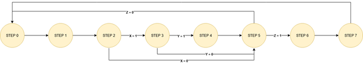
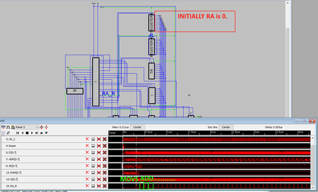
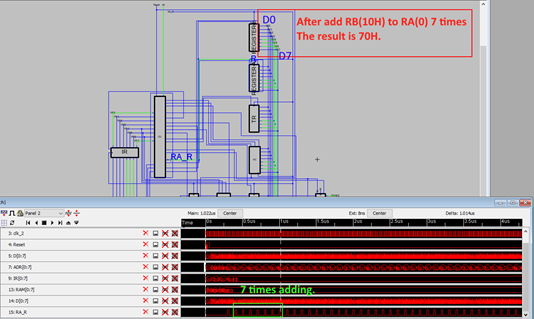
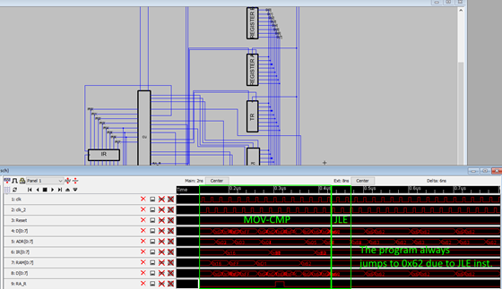

### Project Description

This project purposes 8 bit CPU design by using Electric VLSI. 

### Installation

Firstly, install [Electric VLSI](https://www.staticfreesoft.com/). Then import [ELE419_Project.jelib](https://github.com/selcukholep/FPGA-CPU-Design/blob/master/ELE419_Project.jelib) project file.

### Design Specifications

- **180nm** feature size,
- **5000** transistors,
- **2** general purpose registers,
- **16** different instructions,
- Up to **50Mhz** clock speed in simulation (IRSIM)


### Design Steps

#### Stepper

The stepper is a component which help to control unit when it will be control other components. In other words, stepper controls the control unit’s life cycle.

Totally **8 steps** there are. The steps are explained below:

| Step No | Description                                                  |
| ------- | ------------------------------------------------------------ |
| #0      | Data on program counter(PC) to memory address register(MAR). |
| #1      | Data on ram to instruction register(IR). As the same time increase PC. |
| #2      | If there needs to be take an operand as  immediate data or ram data, **repeat step 0**. If it is not necessary, go  to **step 5**. |
| #3      | Data on RAM to **temp register(TR)***. As  the same time increase PC.<br />**Temp register(TR)\*** *is a register which stores operands (Immediate data, RAM)* |
| #4      | If the operand is RAM address of data, set this address to MAR. |
| #5      | Enable ALU or Control Unit Decoder (CUD) by  checking instruction type;<br /> ( 0 -> CU instruction , 1 -> ALU instruction).<br />After decoding if the instruction; <br />- is a CU instruction, execute and return step  0.<br />- is a ALU instruction, write destination data  to ALU Temp Register(ATR). |
| #6      | Read source data.                                            |
| #7      | Write value of accumulator to destination.                   |


The stepper component has 3 inputs. These inputs help stepper to decide which step is following. 

The state diagram of the stepper is shown below:



#### Instruction Set

| MNEMONIC |  D7  |  D6  |  D5  |  D4  |  D3  |  D2  |  D1  |  D0  |
| -------- | :--: | :--: | :--: | :--: | :--: | :--: | :--: | :--: |
| **NOP**  |  0   |  0   |  0   |  0   |  0   |  X   |  0   |  X   |
| **MOV**  |  0   |  0   |  0   |  1   |  D   |  D   |  S   |  S   |
| **JMP**  |  0   |  0   |  1   |  0   |  0   |  X   |  1   |  0   |
| **JE**   |  0   |  0   |  1   |  1   |  0   |  X   |  1   |  0   |
| **JNE**  |  0   |  1   |  0   |  0   |  0   |  X   |  1   |  0   |
| **JG**   |  0   |  1   |  0   |  1   |  0   |  X   |  1   |  0   |
| **JLE**  |  0   |  1   |  1   |  0   |  0   |  X   |  1   |  0   |
| **HLT**  |  0   |  1   |  1   |  1   |  0   |  X   |  0   |  X   |
|          |      |      |      |      |      |      |      |      |
| **ADD**  |  1   |  0   |  0   |  0   |  0   |  D   |  S   |  S   |
| **SUB**  |  1   |  0   |  0   |  1   |  0   |  D   |  S   |  S   |
| **AND**  |  1   |  0   |  1   |  0   |  0   |  D   |  S   |  S   |
| **OR**   |  1   |  0   |  1   |  1   |  0   |  D   |  S   |  S   |
| **NOT**  |  1   |  1   |  0   |  0   |  0   |  D   |  0   |  X   |
| **CMP**  |  1   |  1   |  0   |  1   |  0   |  D   |  S   |  S   |
| **SHL**  |  1   |  1   |  1   |  0   |  0   |  D   |  0   |  X   |


### Simulation Result

The simulations are made by using **IRSIM**.

**ADD:**   This example adds RB to RA infinitely. 

```assembly
MOV RA, 0x10
MOV RB, 0x07
ADD RA, RB
```





**CMP + JLE:** 

```assembly
MOV RA, 0xFE
MOV RB, 0xFF
CMP RA, RB
JLE 0x52
```




### Contributors

- Selçuk Holep [@sholep](https://www.linkedin.com/in/sholep/)
- Burak Celal Kan [@burakcelalkan](https://www.linkedin.com/in/burak-celal-kan/)

